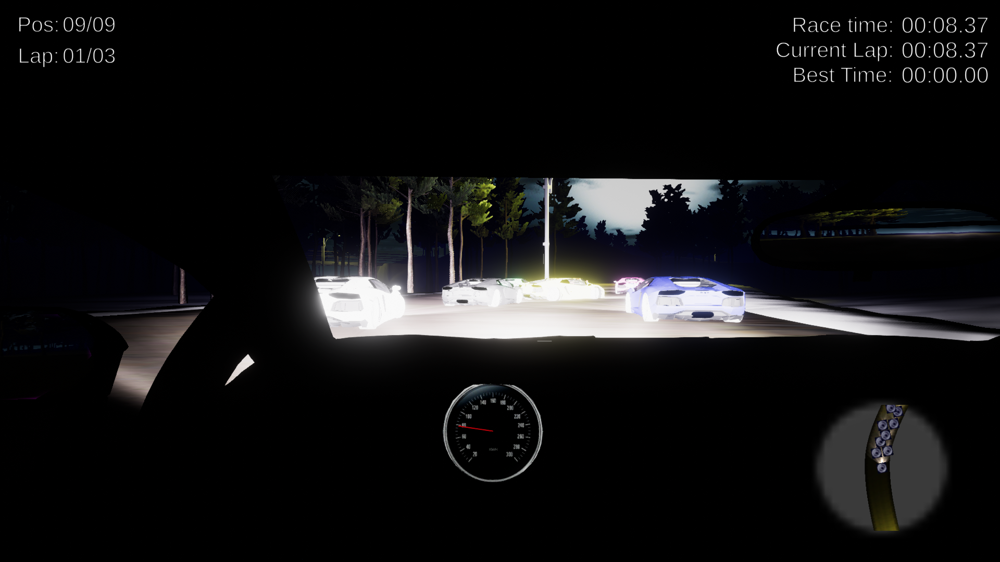
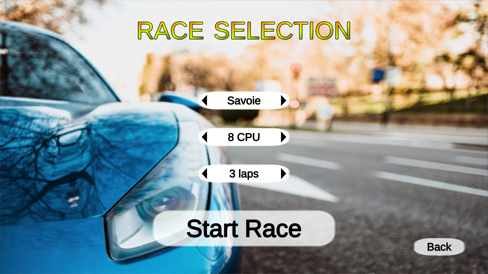

# ElLocoRacing

__⚠ Sound may be too loud, be careful. ⚠__

_El Loco Racing_ is a racing game made under Unity during the 2nd year of master (November 2019 - December 2020), by Emile Romon and Quentin Sauvage.

### Controls

ZQSD / Arrows / Left joystick : Turn the car and accelerate/brake

Escape / P : Pause the game

Left mouse button / Right joystick : Turn the camera

Right button / R1 : Rear view

2 : Decrease the radio volume

8 : Increase the radio volume

4 / 6 : Change the radio music

Space : Car horn

Left shift / X (controller) : Handbrake

R / Y (controller) : Restart to the last checkpoint

### Bugs

Sometimes, when the car turns, the wheels are stuck. If this happens, try to brake and it should work.

For now, the best time of the player can only be seen while playing in the editor. When this will be fixed, it will be possible for the player to import its own musics by copying them in the _Radio_ folder.
